# 🍷 Krasnoe & Beloe Catalog Dataset

[](https://www.python.org/downloads/)
[](https://opensource.org/licenses/MIT)
[](https://playwright.dev/)
[](https://www.sqlite.org/)
[](https://pandas.pydata.org/)
[](https://matplotlib.org/)
[](https://github.com/psf/black)

> 📊 **Автоматизированный парсер каталога** интернет-магазина [Красное & Белое](https://krasnoeibeloe.ru/) с сохранением данных в SQLite и генерацией аналитических PDF-отчётов с графиками и визуализациями.

---

## 📋 Содержание

- [🚀 Возможности](#-возможности)
- [📦 Структура проекта](#-структура-проекта)
- [⚙️ Установка](#️-установка)
- [🎯 Использование](#-использование)
- [ Аналитические отчёты](#-аналитические-отчёты)
- [🗄️ База данных](#️-база-данных)
- [🔧 Технологии](#-технологии)
- [📝 Примеры](#-примеры)
- [🤝 Вклад в проект](#-вклад-в-проект)
- [📄 Лицензия](#-лицензия)

---

## 🚀 Возможности

### ️ Парсинг данных
- ✅ **Обход Cloudflare** через Playwright с эмуляцией браузера
- ✅ **Автоматическое подтверждение возраста** (18+)
- ✅ **Пагинация** — обход всех страниц каждой категории
- ✅ **Извлечение данных товара**: название, цена, рейтинг, страна, объём, крепость
- ✅ **Скачивание изображений** товаров с сортировкой по категориям

###  Аналитика
- ✅ **17 различных отчётов** с визуализациями
- ✅ **PDF-отчёты** с графиками, диаграммами и таблицами
- ✅ **WordCloud** из названий товаров
- ✅ **Статистический анализ**: цены, рейтинги, скидки, крепость

### 💾 Хранение данных
- ✅ **SQLite база данных** с индексацией
- ✅ **Дедупликация** товаров по уникальному ID
- ✅ **Структурированное хранение** всех метаданных

---

## 📦 Структура проекта

```
krasnoye_beloe_catalog_dataset/
│
├── 📄 main.py                    # Парсер каталога
├── 📄 reports.py                 # Генератор аналитических отчётов
├── 📄 requirements.txt           # Зависимости проекта
├── 📄 README.md                  # Документация
│
├── 📁 catalog/                   # Скачанные изображения товаров
│   ├── 📁 Вино/
│   ├── 📁 Пиво/
│   ├── 📁 Крепкий алкоголь/
│   └── ...
│
├── 📁 reports/                   # Сгенерированные отчёты
│   ├── 📄 report_YYYYMMDD_HHMMSS.pdf
│   └──  temp/                  # Временные файлы графиков
│       ├── 🖼️ top_categories.png
│       ├── 🖼️ price_distribution.png
│       └── ...
│
├── 🗄️ krasnoe_beloe_products.db  # База данных SQLite
└── ️ arial.ttf                  # Шрифт для PDF (кириллица)
```

---

## ⚙️ Установка

### 1️⃣ Клонирование репозитория

```bash
git clone https://github.com/yourusername/krasnoye_beloe_catalog_dataset.git
cd krasnoye_beloe_catalog_dataset
```

### 2️⃣ Создание виртуального окружения

```bash
# Windows
python -m venv venv
venv\Scripts\activate

# Linux/Mac
python3 -m venv venv
source venv/bin/activate
```

### 3️⃣ Установка зависимостей

```bash
pip install -r requirements.txt
```

**Или вручную:**

```bash
pip install playwright beautifulsoup4 requests pandas matplotlib seaborn numpy fpdf2 wordcloud
playwright install chromium
```

### 4️⃣ Файл `requirements.txt`

```txt
playwright>=1.40.0
beautifulsoup4>=4.12.0
requests>=2.31.0
pandas>=2.0.0
matplotlib>=3.7.0
seaborn>=0.12.0
numpy>=1.24.0
fpdf2>=2.7.0
wordcloud>=1.9.0
```

---

## 🎯 Использование

### Шаг 1: Парсинг каталога

```bash
python main.py
```

**Что происходит:**
1. 🌐 Открывается браузер Chromium
2. 🔞 Появляется окно подтверждения возраста — нажми **"Мне есть 18 лет"**
3. 📋 Скрипт парсит все категории из левого меню
4. 📦 Для каждой категории проходит по всем страницам пагинации
5. 💾 Сохраняет данные товаров в SQLite
6. 🖼️ Скачивает изображения в папку `catalog/`

**Пример вывода:**
```
============================================================
Скрипт для скачивания картинок с Красное&Белое
============================================================
Открываю https://krasnoeibeloe.ru/catalog/...

ВАЖНО!
1. Если появилось окно подтверждения возраста - нажми 'Мне есть 18 лет'
2. Если появилась капча - пройди её
3. Дождись полной загрузки страницы каталога
============================================================

Нажми Enter когда страница полностью загрузится...
[Enter]

Найдено 25 категорий

============================================================
Начинаю обработку 25 категорий...
============================================================

[1/25] Обработка: Вино
  Найдено страниц: 45
  === Страница 1/45 ===
    Найдено товаров: 20, изображений: 20
  === Страница 2/45 ===
    ...
  Всего уникальных изображений: 900
  Скачано 900 из 900 изображений
  Сохранено товаров в БД: 900
```

### Шаг 2: Генерация отчётов

```bash
python reports.py
```

**Что происходит:**
1.  Анализирует базу данных
2.  Генерирует 17 графиков и визуализаций
3. 📄 Создаёт PDF-отчёт с титульной страницей и всеми отчётами
4. 💾 Сохраняет в папку `reports/`

**Пример вывода:**
```
======================================================================
Генерация отчетов...
======================================================================
[1/10] Подключение к БД...
Загружено товаров: 2129
[2/10] Статистика...
[3/10] Категории...
...
[10/10] Генерация PDF...

ГОТОВО!
PDF: C:\github\krasnoye_beloe_catalog_dataset\reports\report_20260704_143022.pdf
Графики: C:\github\krasnoye_beloe_catalog_dataset\reports\temp
```

---

## 📊 Аналитические отчёты

### 📈 Список отчётов

| № | Название отчёта | Тип визуализации | Описание |
|---|----------------|------------------|----------|
| 1 | **Общая статистика** | Текст | Количество товаров, категорий, стран |
| 2 | **Топ-15 категорий** | Bar Chart | Рейтинг категорий по количеству товаров |
| 3 | **Распределение цен** | Histogram | Гистограмма цен с средней и медианой |
| 4 | **Средняя цена по категориям** | Bar Chart | Какие категории дороже |
| 5 | **Топ-15 стран** | Bar Chart | Откуда больше всего товаров |
| 6 | **Средняя цена по странам** | Bar Chart | Какие страны дороже |
| 7 | **Распределение рейтингов** | Bar Chart | Популярные рейтинги |
| 8 | **Анализ скидок** | Pie + Histogram | Доля товаров со скидкой и размеры скидок |
| 9 | **Анализ объёмов** | Bar Chart | Распределение по объёму (0.5л, 0.7л, etc.) |
| 10 | **Анализ крепости** | Histogram | Распределение % алкоголя |
| 11 | **Корреляция цена-рейтинг** | Scatter Plot | Зависимость цены от рейтинга |
| 12 | **Boxplot цен** | Box Plot | Разброс цен по категориям |
| 13 | **WordCloud** | Облако слов | Популярные слова в названиях |
| 14 | **Топ "брендов"** | Bar Chart | Топ-15 первых слов в названиях |
| 15 | **Цена по крепости** | Dual Axis Chart | Двойной график цена vs крепость |
| 16 | **Топ-20 дорогих** | Таблица | Самые дорогие товары |
| 17 | **Топ-20 дешёвых** | Таблица | Самые дешёвые товары |

### 🖼️ Примеры графиков

#### 1. Топ категорий
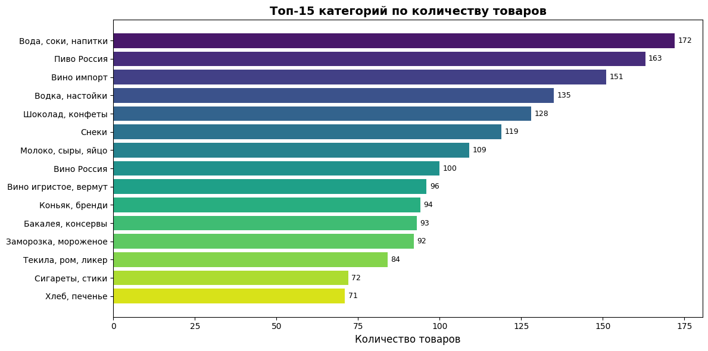

#### 2. Распределение цен
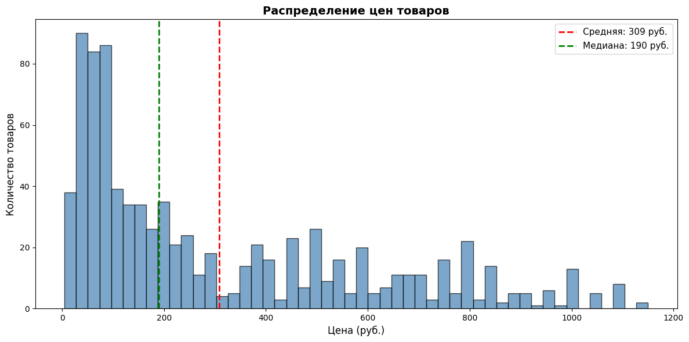

#### 3. Средняя цена по категориям
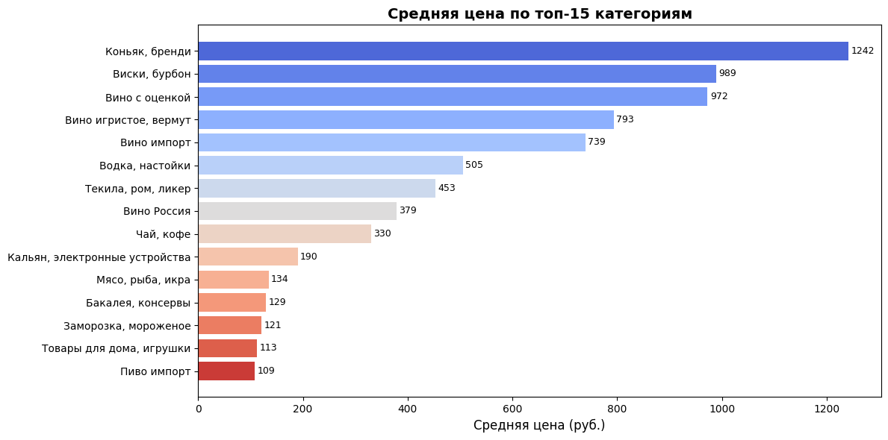

#### 4. Топ стран
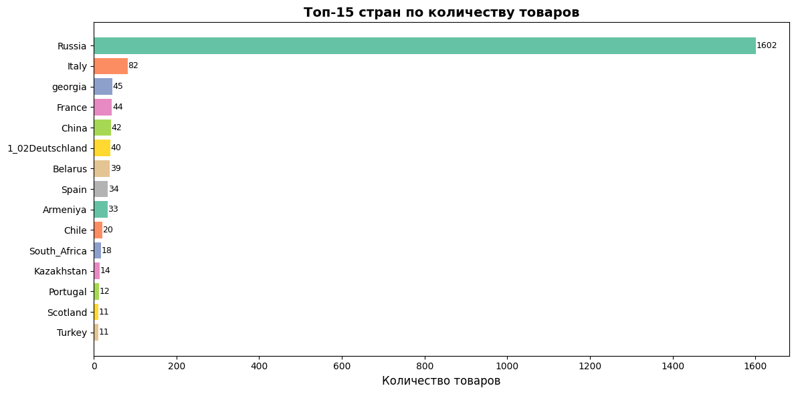

#### 5. Средняя цена по странам
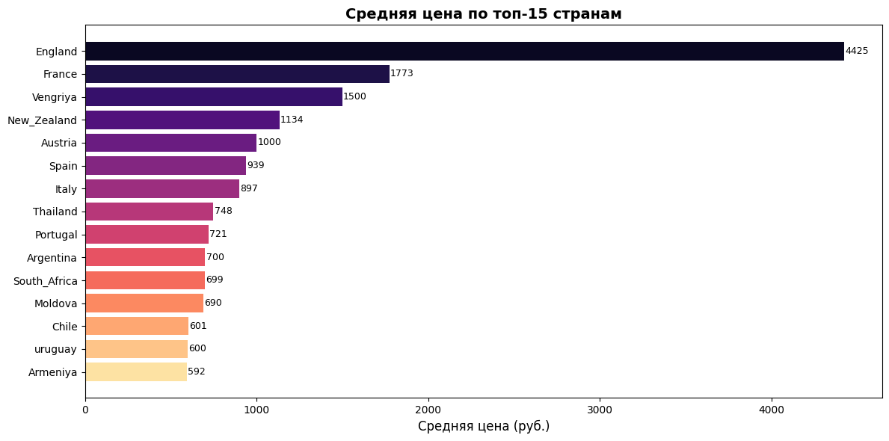


#### 7. Анализ скидок
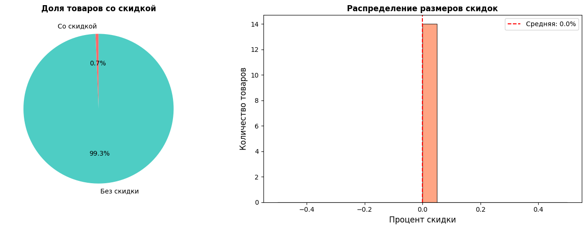

#### 8. Анализ объёмов
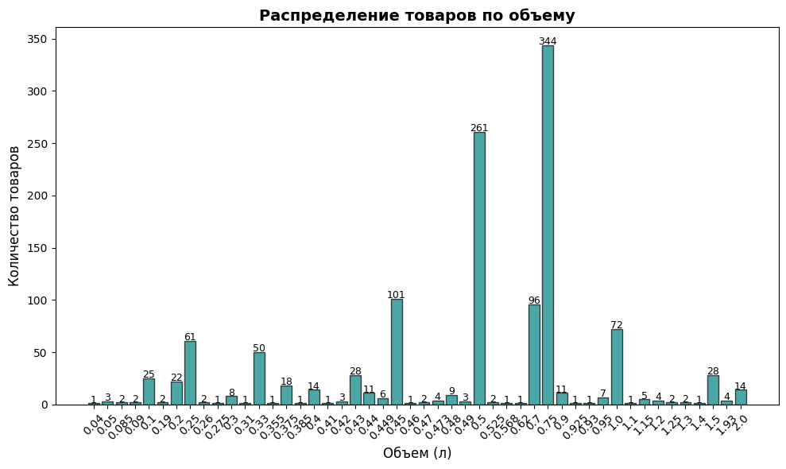

#### 9. Анализ крепости
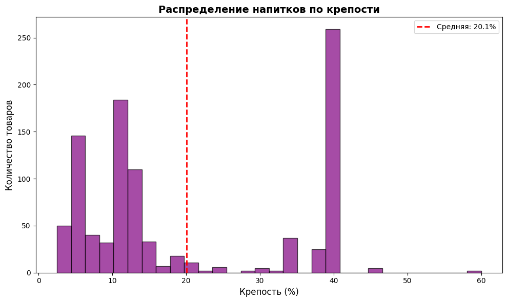


#### 11. Boxplot цен по категориям
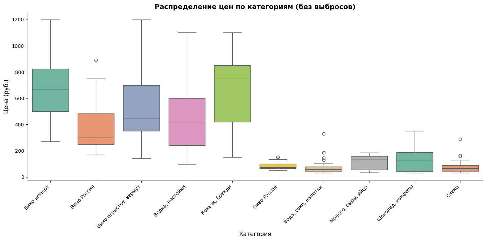

#### 12. Облако слов
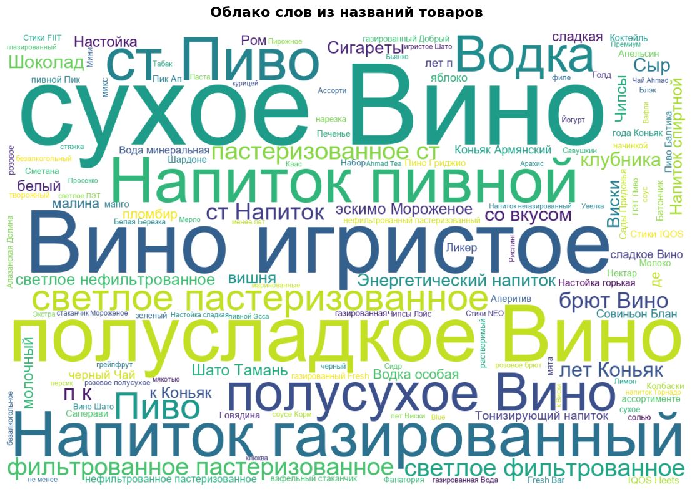

#### 13. Топ "брендов"
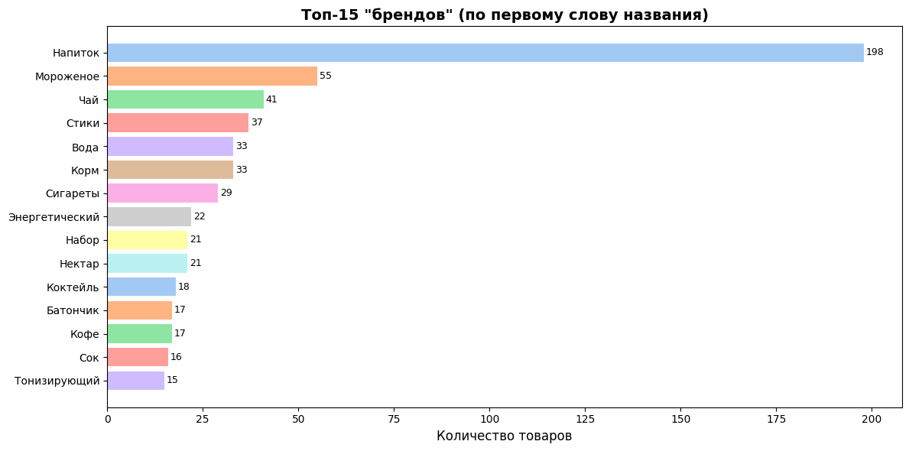

#### 14. Цена по крепости
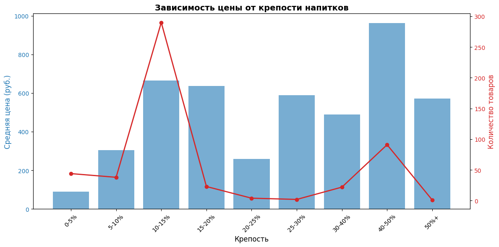
---

## 🗄️ База данных

### Схема таблицы `products`

```sql
CREATE TABLE products (
    id INTEGER PRIMARY KEY AUTOINCREMENT,
    product_id TEXT UNIQUE,           -- Уникальный ID товара
    name TEXT NOT NULL,               -- Название товара
    category TEXT,                    -- Категория
    url TEXT,                         -- Ссылка на товар
    image_url TEXT,                   -- Ссылка на изображение
    country TEXT,                     -- Страна производства
    details TEXT,                     -- Детали (объём, регион, крепость)
    price REAL,                       -- Цена (руб.)
    currency TEXT,                    -- Валюта (RUB)
    rating REAL,                      -- Рейтинг (0.5 - 5.0)
    discount_price REAL,              -- Цена со скидкой
    scraped_at TIMESTAMP              -- Дата парсинга
);

-- Индексы для ускорения поиска
CREATE INDEX idx_product_id ON products(product_id);
CREATE INDEX idx_category ON products(category);
CREATE INDEX idx_name ON products(name);
```

### Пример данных

| id | product_id | name | category | price | country | rating |
|----|-----------|------|----------|-------|---------|--------|
| 1 | 4176922 | Пиво Стелла Артуа светлое ж/б стяжка | Всё для пикника | 149.99 | Russia | 4.5 |
| 2 | 4176930 | Напиток газированный Fresh Bar Кола | Всё для пикника | 89.99 | Russia | 4.0 |
| 3 | 4255608 | Вино Баррелая красное полусухое | Вино | 799.99 | Italy | 4.5 |

### SQL-запросы для анализа

```sql
-- Топ-10 самых дорогих товаров
SELECT name, price, country 
FROM products 
ORDER BY price DESC 
LIMIT 10;

-- Средняя цена по категориям
SELECT category, AVG(price) as avg_price, COUNT(*) as count
FROM products
WHERE price IS NOT NULL
GROUP BY category
ORDER BY avg_price DESC;

-- Товары со скидкой больше 30%
SELECT name, price, discount_price,
       ROUND((price - discount_price) / price * 100, 1) as discount_percent
FROM products
WHERE discount_price IS NOT NULL
  AND (price - discount_price) / price > 0.3;

-- Распределение по странам
SELECT country, COUNT(*) as count
FROM products
GROUP BY country
ORDER BY count DESC;
```

---

## 🔧 Технологии

### 🐍 Python библиотеки

| Библиотека | Версия | Назначение |
|-----------|--------|------------|
| [Playwright](https://playwright.dev/) | 1.40+ | Браузерная автоматизация, обход Cloudflare |
| [BeautifulSoup4](https://www.crummy.com/software/BeautifulSoup/) | 4.12+ | Парсинг HTML |
| [Requests](https://requests.readthedocs.io/) | 2.31+ | HTTP-запросы для скачивания изображений |
| [Pandas](https://pandas.pydata.org/) | 2.0+ | Работа с данными и DataFrame |
| [Matplotlib](https://matplotlib.org/) | 3.7+ | Построение графиков |
| [Seaborn](https://seaborn.pydata.org/) | 0.12+ | Статистическая визуализация |
| [NumPy](https://numpy.org/) | 1.24+ | Численные вычисления |
| [FPDF2](https://pyfpdf.github.io/fpdf2/) | 2.7+ | Генерация PDF |
| [WordCloud](https://amueller.github.io/word_cloud/) | 1.9+ | Генерация облака слов |
| [SQLite3](https://docs.python.org/3/library/sqlite3.html) | 3.0+ | Встроенная база данных |

### 🌐 Браузер

- **Chromium** (встроен в Playwright) — для эмуляции реального браузера

---

## 📝 Примеры использования

### 🔍 Поиск товаров в базе

```python
import sqlite3
import pandas as pd

conn = sqlite3.connect('krasnoe_beloe_products.db')

# Найти все вина из Италии дороже 1000 рублей
query = """
    SELECT name, price, details 
    FROM products 
    WHERE category = 'Вино' 
      AND country = 'Italy' 
      AND price > 1000
    ORDER BY price DESC
"""

df = pd.read_sql_query(query, conn)
print(df)

conn.close()
```

###  Быстрый анализ в Python

```python
import pandas as pd
import matplotlib.pyplot as plt

# Загрузить данные
df = pd.read_sql_query("SELECT * FROM products", 
                       sqlite3.connect('krasnoe_beloe_products.db'))

# Статистика по ценам
print(f"Средняя цена: {df['price'].mean():.2f} руб.")
print(f"Медианная цена: {df['price'].median():.2f} руб.")
print(f"Максимальная цена: {df['price'].max():.2f} руб.")

# Гистограмма цен
plt.figure(figsize=(10, 6))
plt.hist(df['price'].dropna(), bins=50, color='blue', alpha=0.7)
plt.title('Распределение цен')
plt.xlabel('Цена (руб.)')
plt.ylabel('Количество товаров')
plt.show()
```

---

##  Вклад в проект

Приветствуются любые улучшения! 🎉

### Как внести вклад:

1. **Fork** репозиторий
2. Создайте ветку для фичи (`git checkout -b feature/AmazingFeature`)
3. **Commit** изменения (`git commit -m 'Add some AmazingFeature'`)
4. **Push** в ветку (`git push origin feature/AmazingFeature`)
5. Откройте **Pull Request**

---

## ️ Важные замечания

###  Обход защиты

- Скрипт использует **Playwright** для эмуляции реального браузера
- При первом запуске может потребоваться **ручное прохождение капчи**
- Рекомендуется делать **паузы** между запросами (реализовано в коде)

### ⚖️ Юридические аспекты

> ⚠️ **Внимание:** Этот проект создан в образовательных целях. Перед использованием убедитесь, что парсинг не нарушает условия использования сайта [krasnoeibeloe.ru](https://krasnoeibeloe.ru/).

- Не используйте для коммерческих целей без разрешения
- Соблюдайте `robots.txt` сайта
- Не создавайте чрезмерную нагрузку на сервер

### 🐛 Известные проблемы

- **Рейтинг не извлекается** — сайт использует JavaScript для отображения рейтинга, требуется доработка парсера
- **Дубликаты товаров** — возможны при изменении структуры URL
- **Cloudflare** — иногда требует ручного прохождения капчи

---

## 📄 Лицензия

Этот проект распространяется под лицензией **MIT**. См. файл [LICENSE](LICENSE) для подробностей.

```
MIT License

Copyright (c) 2026 Your Name

Permission is hereby granted, free of charge, to any person obtaining a copy
of this software and associated documentation files (the "Software"), to deal
in the Software without restriction, including without limitation the rights
to use, copy, modify, merge, publish, distribute, sublicense, and/or sell
copies of the Software, and to permit persons to whom the Software is
furnished to do so, subject to the following conditions:

The above copyright notice and this permission notice shall be included in all
copies or substantial portions of the Software.

THE SOFTWARE IS PROVIDED "AS IS", WITHOUT WARRANTY OF ANY KIND, EXPRESS OR
IMPLIED, INCLUDING BUT NOT LIMITED TO THE WARRANTIES OF MERCHANTABILITY,
FITNESS FOR A PARTICULAR PURPOSE AND NONINFRINGEMENT. IN NO EVENT SHALL THE
AUTHORS OR COPYRIGHT HOLDERS BE LIABLE FOR ANY CLAIM, DAMAGES OR OTHER
LIABILITY, WHETHER IN AN ACTION OF CONTRACT, TORT OR OTHERWISE, ARISING FROM,
OUT OF OR IN CONNECTION WITH THE SOFTWARE OR THE USE OR OTHER DEALINGS IN THE
SOFTWARE.
```


---

## 🙏 Благодарности

- [Playwright](https://playwright.dev/) — за мощную браузерную автоматизацию
- [Красное & Белое](https://krasnoeibeloe.ru/) — за интересный каталог для парсинга
- Сообществу Python — за отличные библиотеки

---

<div align="center">

**⭐ Если проект вам понравился — поставьте звезду на GitHub! ⭐**

Made with ❤️ and Python

</div>
